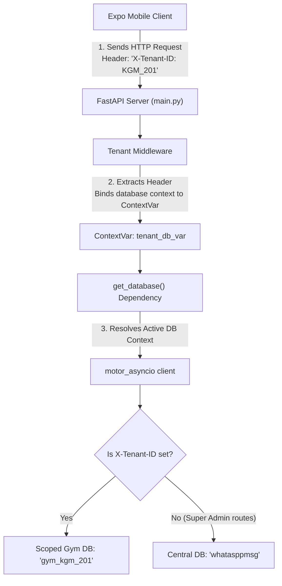
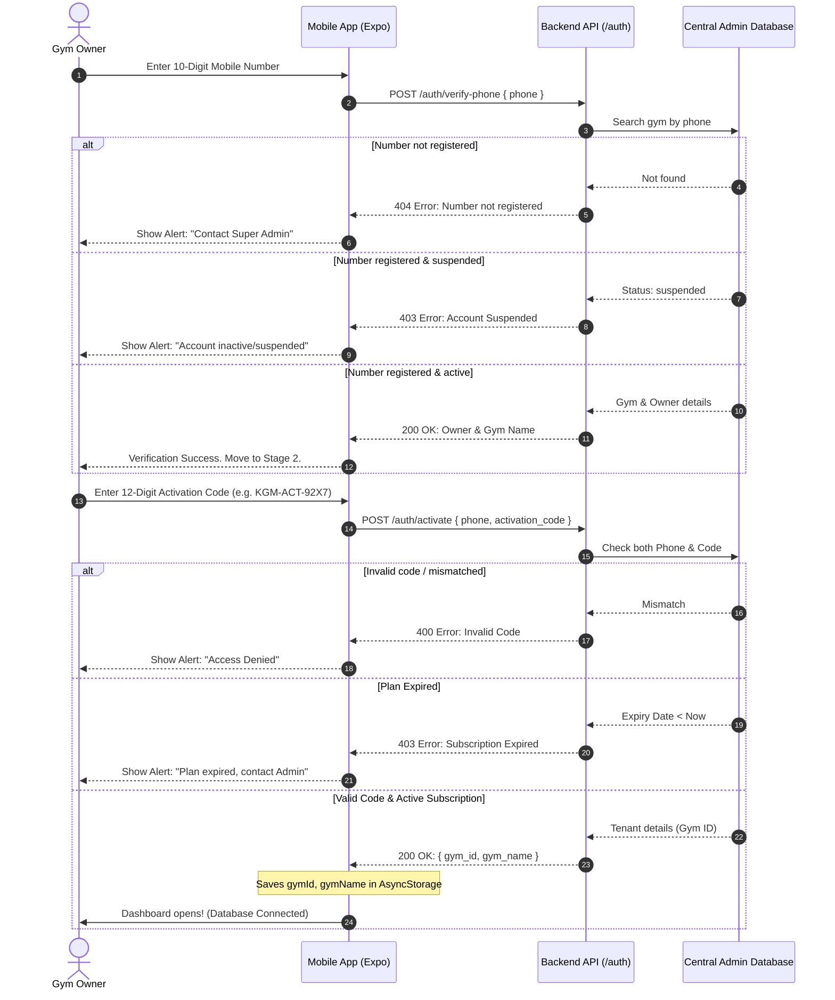
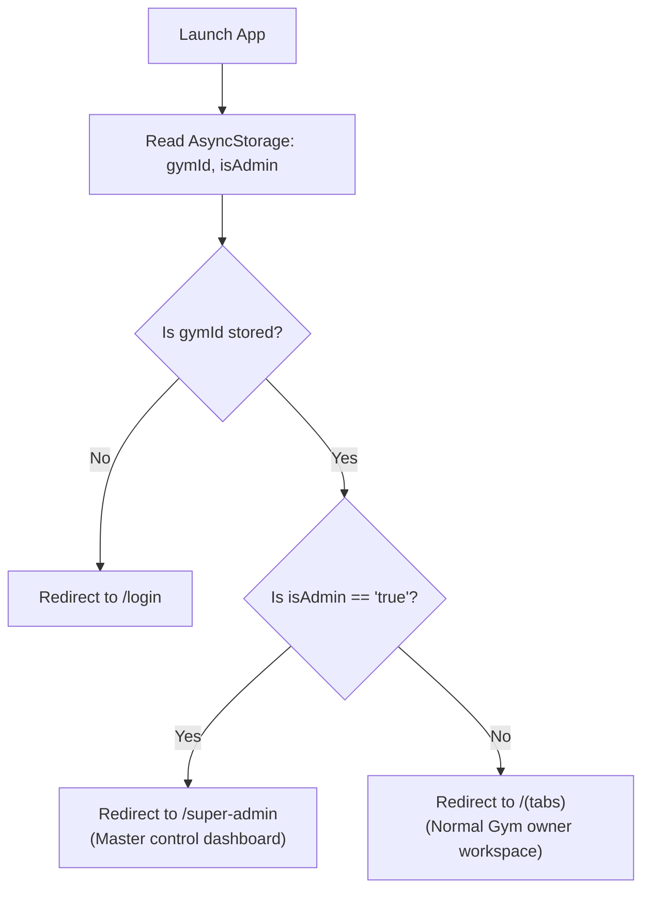

# Super Admin & Multi-Tenant Activation System — Workplan Flow & Architecture

This document outlines the detailed system architecture, verification workflow, database designs, and implementation flow for the **SaaS Multi-Tenant Gym Management System**.

---

## 1. System Architecture & Request Flow

The system uses a dynamic, request-scoped context to resolve the correct isolated database at runtime without code duplication or hardcoded switches.



---

## 2. Double Verification Flow (Login & Onboarding)

To ensure high-grade data isolation and security, gym owners go through a strict dual-stage validation flow.



---

## 3. Database Schema Design

### A. Central Admin Database (`whatasppmsg` - Main DB)

Stores global records, gym mappings, billing schedules, and global notification logs.

#### 1. `gyms` Collection
```json
{
  "_id": "ObjectId",
  "gym_id": "KGM_201",
  "activation_code": "KGM-ACT-9Z2X",
  "owner_name": "Rishabh Kushwaha",
  "phone": "8081161524",
  "gym_name": "Gym",
  "address": "Premium Health Club, Lucknow",
  "plan_duration_months": 12,
  "plan_price": 12000.00,
  "plan_expiry": "ISODate('2027-05-17T19:30:00Z')",
  "status": "active", // active, inactive, suspended
  "created_at": "ISODate('2026-05-17T19:30:00Z')"
}
```

#### 2. `whatsapp_logs` Collection
```json
{
  "_id": "ObjectId",
  "phone": "8081161524",
  "message": "*GYM - REGISTRATION SUCCESSFUL*...",
  "type": "registration_success", // registration_success, activation_details, custom_manual
  "logged_at": "ISODate('2026-05-17T19:30:00Z')",
  "sent": true // marked true once forwarded via WhatsApp
}
```

---

### B. Isolated Gym Database (`gym_<gym_id>` - e.g., `gym_kgm_201`)

Each gym partner has a dedicated database, fully isolated from other gyms.

| Collection | Description | Main Fields |
| :--- | :--- | :--- |
| **`members`** | Gym members profiles | `member_id`, `full_name`, `phone`, `joining_date`, `next_due_date`, `status` |
| **`payments`** | Billing receipts history | `member_id`, `amount`, `payment_date`, `payment_method`, `type` |
| **`attendance`**| Daily check-in tracking | `member_id`, `member_name`, `check_in_time` |
| **`settings`** | Isolated gym configurations | `type: gym_profile`, `gym_name`, `address`, `phone`, `logo_url` |
| **`messages`** | Sent membership alerts | `recipient_phone`, `message_body`, `sent_at`, `status` |

---

## 4. API Endpoints Map

### A. Authentication & Verification (`/api/v1/auth`)

*   **POST `/verify-phone`**
    *   *Payload:* `{"phone": "8081161524"}`
    *   *Response (200):* `{"status": "success", "gym_name": "Gym", "owner_name": "Rishabh Kushwaha"}`
*   **POST `/activate`**
    *   *Payload:* `{"phone": "8081161524", "activation_code": "KGM-ACT-9Z2X"}`
    *   *Response (200):* `{"status": "success", "gym_id": "KGM_201", "gym_name": "Gym"}`

### B. Super Admin Control Panel (`/api/v1/super-admin`)

*   **POST `/login`**
    *   *Payload:* `{"phone": "8081161524", "super_admin_id": "142001_kush"}`
    *   *Response (200):* `{"status": "success", "is_admin": true}`
*   **POST `/gyms`** (Register a gym & seed tenant settings database)
    *   *Payload:* `{"owner_name": "Kush", "phone": "9999999999", "gym_name": "Iron Gym", "address": "Lucknow", "plan_duration_months": 3, "plan_price": 4500}`
*   **GET `/gyms?q=Lucknow`** (Search, list, and filter registered partners)
*   **POST `/gyms/{gym_id}/status`** (Set account active, inactive, or suspended)
*   **POST `/gyms/{gym_id}/renew`** (Extend plan expiry dynamically)
*   **DELETE `/gyms/{gym_id}`** (Drops complete isolated tenant database)
*   **POST `/send-message`** (Log custom admin announcement notices)

---

## 5. Mobile Routing Strategy

The client checks status and switches contexts dynamically at boot time using [index.tsx](file:///d:/Newevent/whataspsp/frontend/app/index.tsx):



### AsyncStorage Keys
*   `gymId`: Dynamic Gym Identifier (Acts as tenant DB router).
*   `gymName`: Name of the connected gym.
*   `ownerName`: Registered owner's name.
*   `isAdmin`: `"true"` for Super Admin workspace, otherwise `"false"`.

---

## 6. Automated WhatsApp Templates

All notifications are generated on the server and logged in `whatsapp_logs`. Super Admins can dispatch them instantly with one click using the built-in deep-linking mechanism.

### 1. Registration Success Template
```text
*GYM - REGISTRATION SUCCESSFUL* 🎉

Dear *[Owner Name]*,

Your mobile number *[Phone]* has been registered successfully as the Gym Owner of *[Gym Name]*.
```

### 2. Activation Details Template
```text
*GYM - ACTIVATION DETAILS* 🔑

Hi *[Owner Name]* 💪,
Your separate database has been created successfully!

━━━━━━━━━━━━━━━━━━━━
📍 *Gym ID:* `[Gym ID]`
🔑 *Activation Code:* `[Activation Code]`
━━━━━━━━━━━━━━━━━━━━

🚀 *Login Instructions:*
1. Open the App.
2. Enter your registered mobile number: *[Phone]*.
3. Enter your activation code: *[Activation Code]*.

Welcome to the premium club management experience! 🏋️‍♂️
```

### 3. Subscription Renewal Template
```text
*GYM - SUBSCRIPTION RENEWED* ✅

Hi *[Owner Name]* 🎉,
Your subscription for *[Gym Name]* has been successfully renewed!

━━━━━━━━━━━━━━━━━━━━
📅 *New Expiry Date:* [New Expiry Date]
⏱️ *Duration:* [Duration] Month(s)
💳 *Price:* ₹[Plan Price]
━━━━━━━━━━━━━━━━━━━━

Thank you for your business! Let's continue growing! 💪
```
